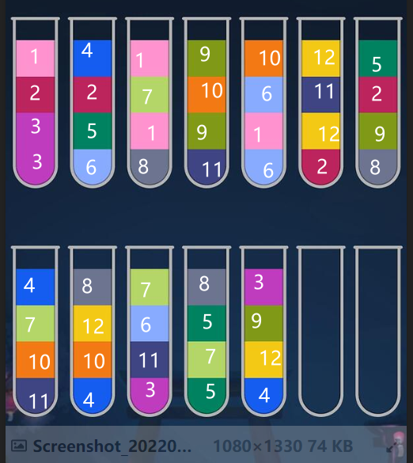

# Tube Pour Solver

试管倾倒同色问题的一个求解器。


## 输入与输出

输入：每个试管内的颜色分层，从下到上，需要手动给每个颜色指定一个数字。

输出：使得最后每个试管内只有一种颜色液体的倾倒顺序。

## 工作原理

TL;DR：A* 搜索

heuristic：空试管0，纯色1，混合=颜色数+1

不保证解最优。

## 使用示例

以下为 example2，也参考 example1。



```python
tubes = [
    Tube([3,3,2,1]),
    Tube([6,5,2,4]),
    Tube([8,1,7,1]),
    Tube([11,9,10,9]),
    Tube([6,1,6,10]),
    Tube([2,12,11,12]),
    Tube([8,9,2,5]),
    Tube([11,10,7,4]),
    Tube([4,10,12,8]),
    Tube([3,11,6,7]),
    Tube([5,7,5,8]),
    Tube([4,12,9,3]),
    Tube([]),
    Tube([]),
]

# print(tubes)
state = State(tubes)
# print(state)

# print(state.target_mix_value)

found_moves = a_star_search(state)
print("required moves:", len(found_moves))

for idx, move in enumerate(found_moves):
    print(f"{idx+1}: {move[0]} -> {move[1]}")
```

```
required moves: 42
1: [11, 10, 7, 4] -> []
2: [11, 10, 7] -> []
3: [6, 1, 6, 10] -> [11, 10]
4: [3, 11, 6, 7] -> [7]
5: [6, 5, 2, 4] -> [4]
6: [6, 1, 6] -> [3, 11, 6]
7: [8, 1, 7, 1] -> [6, 1]
8: [8, 1, 7] -> [7, 7]
9: [8, 1] -> [6, 1, 1]
10: [5, 7, 5, 8] -> [8]
11: [8, 9, 2, 5] -> [5, 7, 5]
12: [6, 5, 2] -> [8, 9, 2]
13: [5, 7, 5, 5] -> [6, 5]
14: [5, 7] -> [7, 7, 7]
15: [6, 5, 5, 5] -> [5]
16: [3, 11, 6, 6] -> [6]
17: [4, 10, 12, 8] -> [8, 8]
18: [2, 12, 11, 12] -> [4, 10, 12]
19: [2, 12, 11] -> [3, 11]
20: [4, 10, 12, 12] -> [2, 12]
21: [11, 10, 10] -> [4, 10]
22: [11] -> [3, 11, 11]
23: [6, 1, 1, 1] -> []
24: [3, 3, 2, 1] -> [1, 1, 1]
25: [6, 6, 6] -> [6]
26: [2, 12, 12, 12] -> []
27: [3, 3, 2] -> [2]
28: [8, 9, 2, 2] -> [2, 2]
29: [4, 12, 9, 3] -> [3, 3]
30: [8, 9] -> [4, 12, 9]
31: [8, 8, 8] -> [8]
32: [4, 12, 9, 9] -> []
33: [4, 12] -> [12, 12, 12]
34: [4, 4] -> [4]
35: [4, 10, 10, 10] -> []
36: [4, 4, 4] -> [4]
37: [3, 11, 11, 11] -> []
38: [11, 9, 10, 9] -> [9, 9]
39: [11, 9, 10] -> [10, 10, 10]
40: [11, 9] -> [9, 9, 9]
41: [11, 11, 11] -> [11]
42: [3, 3, 3] -> [3]
```

## 相关链接

[一个令程序鼠反复惊叹的小游戏 - 讨论分享 - 小众软件官方论坛 (appinn.net)](https://meta.appinn.net/t/topic/34279/19)